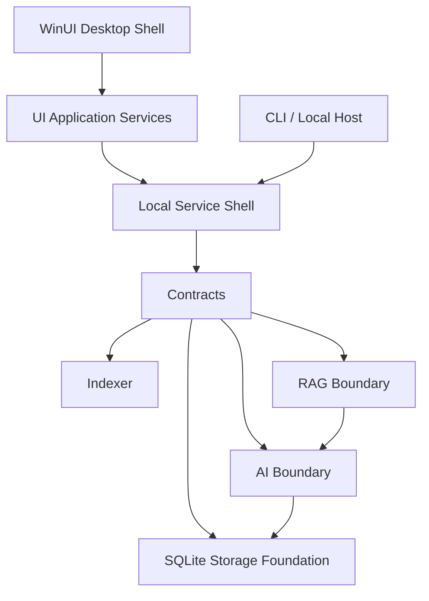
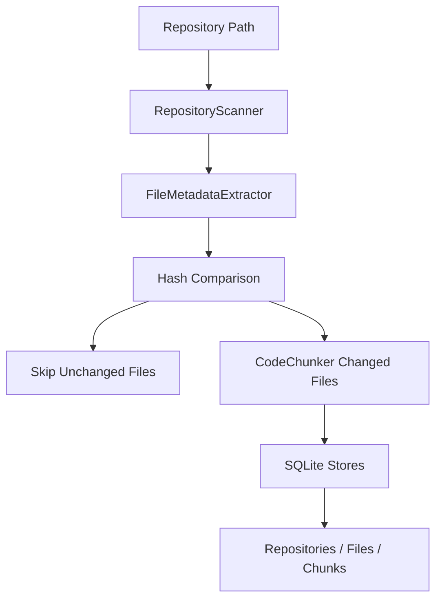
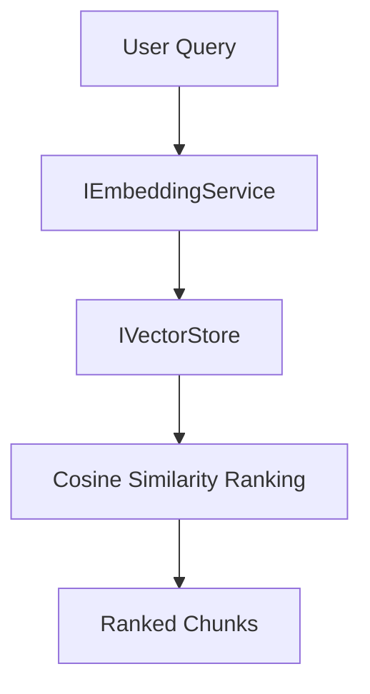
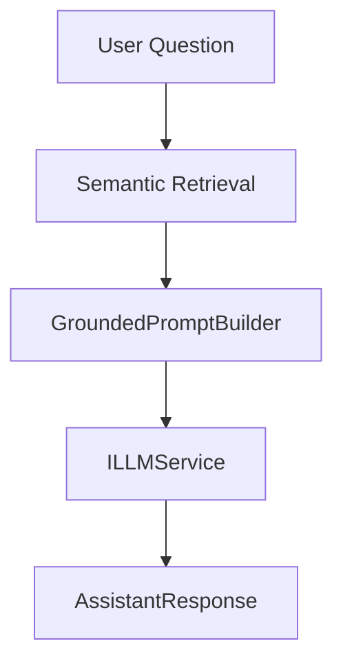
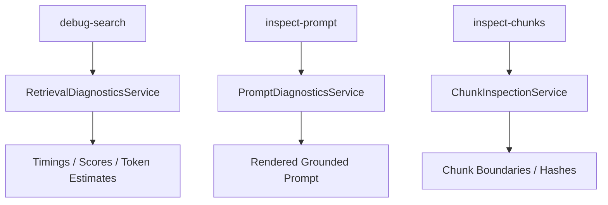
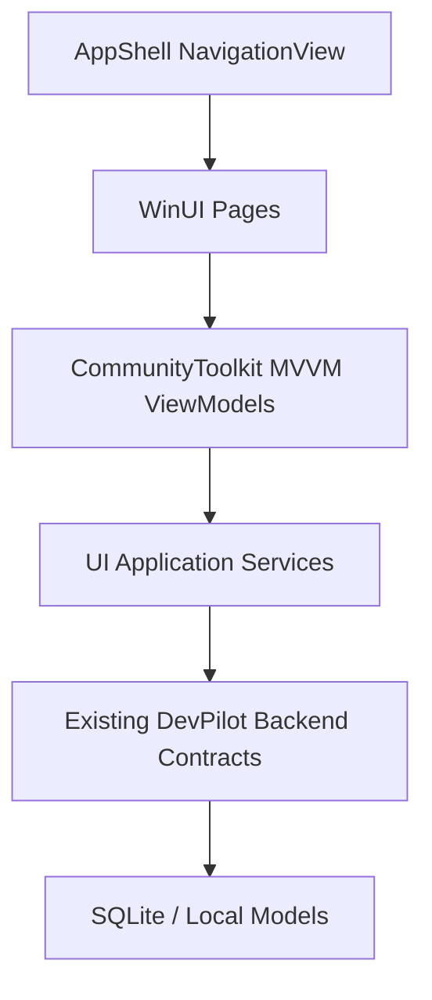

# Architecture Overview

DevPilot is structured as a local-first Windows application foundation.

## Boundaries

The UI layer remains independent from AI runtime details. The desktop assistant flow is:

WinUI Views -> ViewModels -> UI application services -> existing backend services -> SQLite and local models.

## Current Scope

Implemented now:

- Solution and project structure
- DTOs and interfaces
- Dependency injection registration
- Configuration sections
- Logging bootstrap
- SQLite connection factory
- Database schema initialization
- CLI commands
- Test project scaffolding
- Repository indexing pipeline
- File metadata extraction
- Source chunking
- SQLite persistence for repositories, files, and chunks
- Local embedding generation
- SQLite vector persistence
- Semantic search CLI
- Local LLM runtime foundation
- Grounded prompt construction
- Simple RAG ask pipeline
- Incremental indexing with SHA256 change detection
- Embedding version and chunk-hash invalidation
- Retrieval diagnostics, prompt inspection, and chunk inspection CLI tools
- Lightweight runtime timing and SQLite WAL configuration
- WinUI 3 desktop shell
- MVVM ViewModels
- UI facade services over repository indexing, search, assistant, diagnostics, and settings

Intentionally deferred:

- Windows ML
- Microsoft Foundry Local inference
- WinUI screens
- Real all-MiniLM-L6-v2 inference until the local ONNX model is copied into `models/embeddings/all-MiniLM-L6-v2/model.onnx`
- Full Phi-3 generation until the local ONNX model/tokenization assets are available
- Conversational memory and agent workflows

## Indexing Flow

The indexer streams file discovery where practical, applies configured ignore rules, detects language by extension, computes SHA256 hashes, and compares scanned files against stored metadata. Unchanged files are skipped, missing files are deleted, and modified files reconcile their chunk set.

When `Embeddings:GenerateDuringIndexing` is enabled, the indexing service calls the embedding pipeline after chunk persistence. The embedding pipeline skips chunks with current embeddings and regenerates stale ones when the chunk hash, embedding model version, or embedding schema version changes.

## Semantic Search Flow

ONNX Runtime is used by `OnnxEmbeddingService` when the local model file exists. If the model is absent and fallback is enabled, a deterministic local embedding generator keeps development and tests fully offline.

## RAG Flow

The RAG pipeline is intentionally simple. It retrieves the top semantic chunks, builds a prompt that instructs the model to use only provided context, runs the local LLM service, and returns a single grounded answer with referenced files.

If the Phi-3 ONNX model is absent, `OnnxLLMService` uses a grounded extractive fallback so the application remains offline and testable.

## Diagnostics Flow

Diagnostics are read-only inspection surfaces. They reuse retrieval, prompting, token estimation, and storage contracts without coupling those domains to CLI formatting.

## Desktop UI Flow

`DevPilot.UI` owns presentation, binding state, navigation, and user-triggered commands only. Facades map backend DTOs into UI models so ViewModels do not know about SQLite, embedding generation, prompt construction, or inference internals.

## SQLite Schema

`Repositories` stores repository identity and indexed timestamp.

`Files` stores repository file metadata: relative path, extension, language, SHA256 hash, file size, and last modified timestamp.

`Chunks` stores deterministic code/document chunks with symbol name, chunk type, line range, content, language, chunk hash, and approximate token estimate.

`Embeddings` stores chunk vectors as binary float data with model name, dimensions, creation timestamp, embedding model version, embedding schema version, chunk hash, and indexed timestamp.

SQLite runs with foreign keys enabled and uses WAL mode during initialization for better local concurrency and resilience.

sqlite-vss is represented as an optional startup hook. When the extension path is configured, DevPilot attempts to load it; when unavailable, the storage layer uses local cosine similarity over vectors persisted in SQLite.
