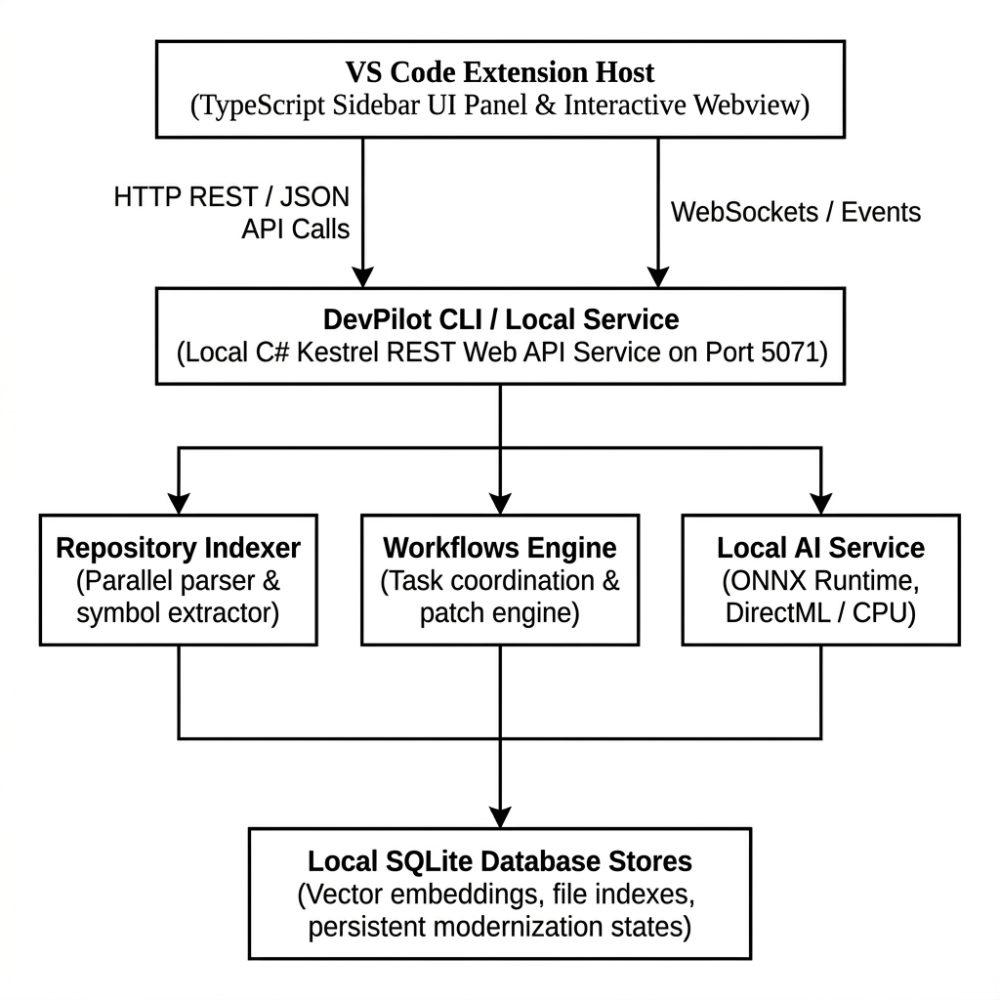
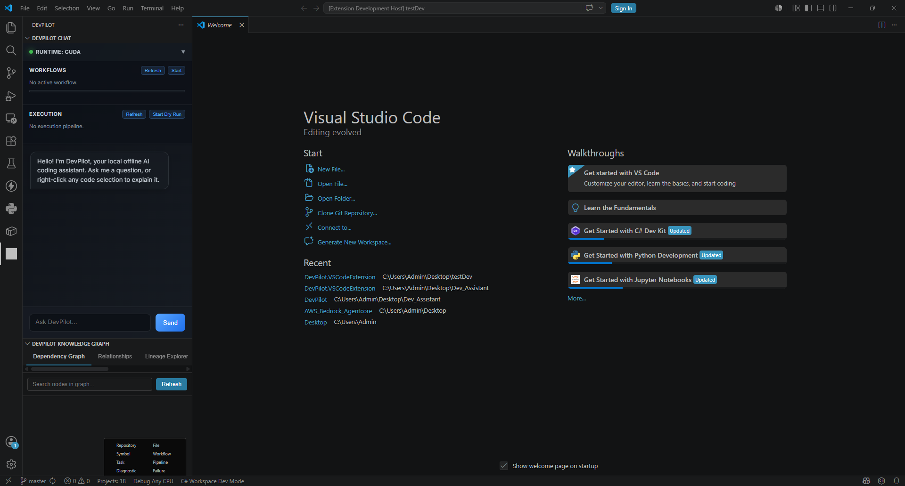
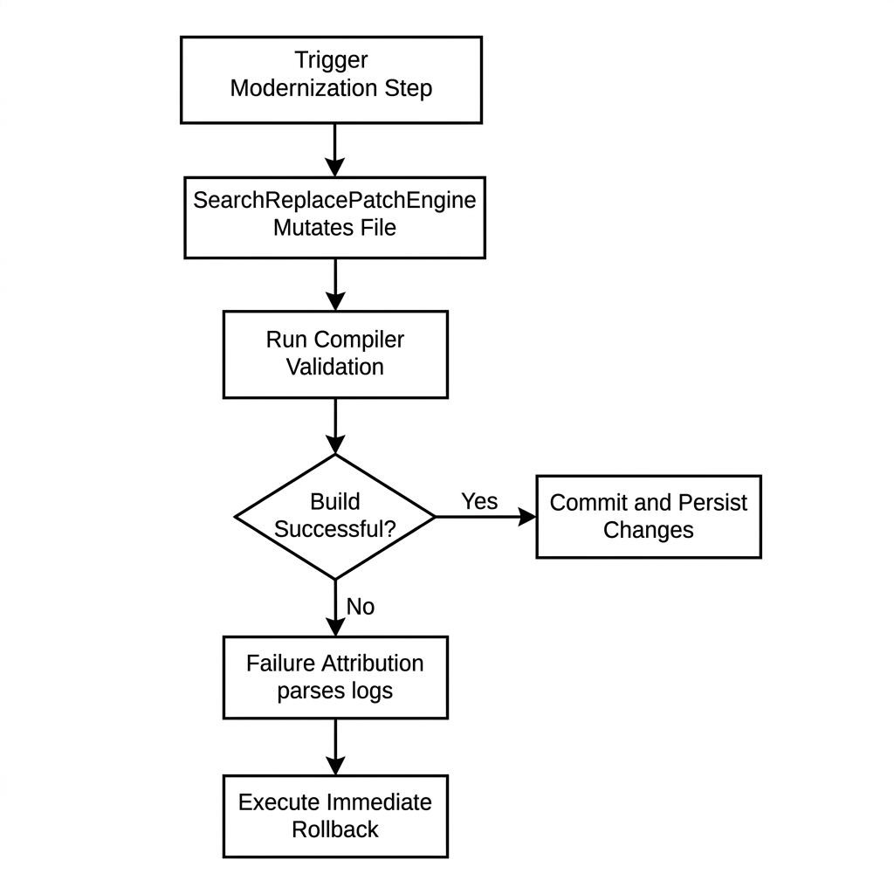

# *DEVPILOT*

Offline-capable local AI-engineering assistant for software developers on Windows operating system.

[](https://dotnet.microsoft.com/download)
[](https://www.typescriptlang.org/)

DevPilot is an offline development assistant to index, search, and refactor code directly on the local machine. By executing quantized ONNX models via ONNX Runtime and DirectML, it provides codebase-aware semantic search, symbol tracking, and automated diagnostics analysis without sending proprietary code to external APIs or requiring internet connectivity.

---

## WHY DEVPILOT EXISTS

Most modern AI coding assistants are built as wrapper interfaces around remote, cloud-hosted large language models. While highly capable, this architecture introduces practical challenges:

* **a. Intellectual Property and Privacy**: Sending proprietary, commercial codebases to third-party endpoints is often prohibited by corporate security policies.
* **b. Lack of Local Context**: Cloud APIs do not have access to the local execution environment, making it difficult to verify compile states, parse test diagnostics, or coordinate multi-step repair workflows.
* **c. Network Dependency**: Intermittent internet access or API latency disrupts developer velocity.

DevPilot explores a different design point: a fully offline engineering assistant that runs quantized models locally, utilizes local hardware acceleration (DirectML/CUDA), integrates with the local compiler and test runners, and coordinates non-destructive development workflows entirely on the local machine.

The project started from a simple idea:

> "What if an AI coding assistant could understand a repository, run builds/tests locally, and safely coordinate engineering workflows without internet and without sending proprietary code to external servers?"

DevPilot is an attempt to explore that idea.

---

## CURRENT CAPABILITIES

### 1. Repository Intelligence
* Parallel codebase indexing
* AST-aware code chunking
* Symbol-aware metadata extraction
* Cross-file relationship mapping
* Semantic vector search over local codebases

### 2. Local AI Inference
* ONNX Runtime execution
* DirectML GPU acceleration
* CUDA GPU acceleration
* CPU fallback support
* Local embedding generation
* Local Phi-3 inference pipeline
* Streaming token responses

### 3. Developer Workflows & Orchestration
* Engineering workflow orchestration
* Task graph execution
* Dry-run validation
* Rollback-safe patching
* Execution pipelines
* Persistent workflow state

### 4. IDE Integration
* VS Code sidebar integration
* Diagnostics-aware prompts
* Terminal failure analysis
* Quick-fix generation
* Selection-aware reasoning
* Interactive relationship viewer

### 5. Local Execution Awareness
* Build failure parsing
* Stack trace analysis
* Test execution awareness
* Runtime diagnostics
* Context-aware repair planning

### 6. Persistent Workspace Memory
* SQLite-backed memory store
* Architectural convention tracking
* Repository modernization memory
* Persistent execution history

---

## TECHNOLOGY STACK

* **Programming Languages**: C#, TypeScript, HTML, CSS
* **Runtime Frameworks**: .NET 8.0 SDK, Node.js (v18+)
* **Local Inference Engines**: ONNX Runtime, ONNX Runtime GenAI
* **Local LLM Models**: Phi-3-mini-4k-instruct-onnx (Quantized INT4 CPU/DirectML and CUDA FP16 variants)
* **Local Embedding Models**: all-MiniLM-L6-v2 (Xenova / ONNX format)
* **Data Storage & Orchestration**: SQLite (System.Data.SQLite, Microsoft.Data.Sqlite)
* **Desktop UI Platform**: WinUI 3, Windows App SDK
* **IDE Extension Platform**: VS Code Extension API
* **Web Service Engine**: ASP.NET Core (Kestrel Web Server)
* **Build Systems & Tooling**: MSBuild, NuGet, npm, esbuild, TypeScript Compiler (tsc)
* **Test Suites & Runners**: xUnit Test Framework, FluentAssertions, Microsoft.NET.Test.Sdk
* **Scripting & Automation**: PowerShell (pwsh)
* **Version Control**: Git
* **Development & Build PC Configuration**: Windows 11 Pro, 13th Gen Intel Core i9 processor, 64 GB RAM, NVIDIA GeForce RTX 4080 with 16 GB VRAM, IntelUHD Graphics 770 with DirectX 12 DirectML support.

---

## ARCHITECTURE OVERVIEW

DevPilot separates the interface from the local computation engine. The VS Code extension acts as a lightweight client that communicates with a local Kestrel Web API service executing on port `5071`.
<br>

<center>

</center>

<br>

* **DevPilot CLI & Kestrel Service**: A lightweight C# Kestrel web API that coordinates workspace indexing, database management, and local LLM execution.
* **Repository Indexer**: A parallel codebase scanner that builds a semantic map of your project in a local SQLite database.
* **Workflows Engine**: Orchestrates execution pipelines, generates localized code patches, and runs compiler-checked validation steps.
* **Local AI Service**: Direct interface to ONNX Runtime, loading embedding and generative models locally onto your CPU or GPU.


### VS Code Sidebar Integration
The TypeScript sidebar extension provides a lightweight, conversational interface with repository-grounded citations and context tracking.
<center>

</center>

### Workflow Execution Pipelines
The C# workflow engine executes modernization and patching operations in distinct task graphs, verifying the system compile state at every step.
<center>

</center>


---

## QUICK START

### 1. Prerequisites
Ensure the following are installed on your Windows machine:
* **Operating System**: Windows 10 or 11
* **Runtime**: [.NET 8.0 SDK](https://dotnet.microsoft.com/download)
* **Environment**: [Node.js v18+](https://nodejs.org)
* **Python**: [Python 3.9+](https://python.org) (required for the Hugging Face CLI, which downloads the Phi-3 ONNX models — the bootstrap script installs the CLI automatically if Python is on PATH)
* **IDE**: [VS Code](https://code.visualstudio.com)
* **Version Control**: [Git](https://git-scm.com)

**Optional (for GPU-accelerated model variants):**
* **NVIDIA CUDA**: [CUDA Toolkit 12.x](https://developer.nvidia.com/cuda-downloads) + [cuDNN 9.x](https://developer.nvidia.com/cudnn) — required only if downloading and running the `cuda` (FP16) model variant (ONNX Runtime Gpu 1.26.0 requires CUDA 12.x and cuDNN 9.x)
* **DirectML**: Ships with Windows 10/11 on DirectX 12 capable GPUs — no manual install needed for the `directml` model variant

> [!NOTE]
> The CPU model variant works out of the box with no additional GPU setup. CUDA and DirectML are only needed if you choose to download those specific model variants via `.\scripts\download-models.ps1 -Variant cuda` or `-Variant directml`.

After ensuring the above prerequisites are met, run the following commands in PowerShell.

### 2. Clone the Repository
```powershell
git clone https://github.com/SnPreethi/DevPilot.git
cd DevPilot
```

### 3. Bootstrap the Environment
Initialize local runtime paths, restore .NET NuGet dependencies, install Node packages, and bundle the extension:
```powershell
# run this command from the root folder (run in DevPilot level)
.\scripts\bootstrap.ps1
```

### 4. Provision Local AI Models
Download Xenova all-MiniLM embeddings and the instruction-tuned Phi-3-mini ONNX models:
```powershell
# Default downloads all variants (CPU, CUDA, DirectML)
.\scripts\download-models.ps1

# Or specify a single variant (e.g. CPU or DirectML):
.\scripts\download-models.ps1 -Variant cpu
```

### 5. Validate Runtime Files
Ensure all downloaded ONNX models, graphs, weights, and tokenizer files are intact and verified:
```powershell
.\scripts\validate-models.ps1
```

### 6. Start the Local API Service
Spin up the background service (port `5071`) which manages index requests, local embedding generation, and LLM inference:
```powershell
dotnet run --project DevPilot/src/DevPilot.CLI/DevPilot.CLI.csproj service
```

### 7. Launch the VS Code Extension
Open the extension client folder in VS Code, and launch the sandboxed developer environment:
1. Open the folder `DevPilot.VSCodeExtension` in VS Code.
2. Press **`F5`** to launch a sandboxed Extension Host.
3. Click the DevPilot icon in the left Activity Bar to begin.

<br>

> **NOTE** - To begin indexing your codebase, running semantic queries, and executing interactive workflows, please refer to the step-by-step guides in the ***docs/*** directory.

---

## REPOSITORY STRUCTURE

```text
├── DevPilot/                        # Primary C# Backend Engine
│   ├── src/                         # Core codebase (AI, Indexer, RAG, Storage, UI, CLI)
│   ├── tests/                       # xUnit test suites
│   ├── data/                        # Local SQLite databases (active state)
│   ├── models/                      # Quantized ONNX weights & manifests
│   ├── cache/                       # Temporary operational caching
│   └── logs/                        # Diagnostics and execution logs
├── DevPilot.VSCodeExtension/        # TypeScript VS Code Sidebar client
├── scripts/                         # Setup, bootstrap, and provisioning scripts
├── docs/                            # Deep-dive architecture and design guides
└── README.md                        # Primary documentation
```

---

## OFFLINE-FIRST PHILOSOPHY

DevPilot operates entirely on your physical machine. By refusing to connect to remote APIs:
* **Zero Code Exfiltration**: Your source code, workspace structures, and local queries never leave your system.
* **Hermetic Environment**: Indexing, semantic embedding generation, vector distance calculations, and LLM inference run strictly within local process boundaries.
* **Low Latency & High Privacy**: Eliminates external API token pricing, rate limits, and network latency while guaranteeing full developer privacy.

---

## CURRENT LIMITATIONS

DevPilot is an experimental platform under active development. Consider these current constraints:
* **Windows-Focused**: Runtimes, hardware-accelerated DirectML configurations, and WinUI assets are engineered primarily for Windows 10 and 11 environments.
* **Model Size Footprint**: Quantized local models require roughly ~2.3 GB of disk space for the CPU/DirectML variants and ~7.6 GB for CUDA FP16, alongside suitable system RAM/VRAM.
* **Performance Variance**: Local inference speeds depend heavily on your local GPU capabilities. CPU fallback is functional but yields lower token generation velocities.
* **Evolving Abstractions**: Workflows, patch engines, and rollback mechanics are experimental and should be monitored during multi-step workspace operations.

---

## ROADMAP

### Current Refinements
* Improve indexing performance for large repositories (50k+ files)
* Stabilize WinUI 3 desktop packaging and MSIX installer generation
* Harden rollback-safe patching across multi-file edit sequences
* Improve token budget allocation and context pruning accuracy
* Reduce cold-start latency for first-time ONNX model loading
* Expand xUnit test coverage across RAG, Storage, and Workflow layers

### Planned Integrations
* **Microsoft Foundry**: Integrate with Azure AI Foundry for optional hybrid local/cloud model orchestration when offline constraints are relaxed
* **Windows ML**: Migrate select inference workloads to the Windows ML runtime for tighter OS-level hardware scheduling and session management
* **Windows APIs**: Leverage native Windows APIs (Windows.AI, WinRT) for system-level acceleration, notification integration, and background task coordination
* **Visual Studio Integration**: Extend IDE support beyond VS Code to Visual Studio 2022 via VSIX extension
* **Language Server Protocol (LSP)**: Implement an LSP server for editor-agnostic inline completions and diagnostics

### Future Scope
* Cross-platform execution environments for macOS (Metal) and Linux (ROCm/Vulkan)
* Multi-agent orchestration with specialized task delegation across planning, patching, and validation agents
* Deeper AST-graph traversal for richer symbol-relation context during repository search
* Persistent engineering memory graphs that carry learned conventions across repositories
* Distributed local inference across multiple machines on a local network
* Support for additional quantized model families beyond Phi-3

---
